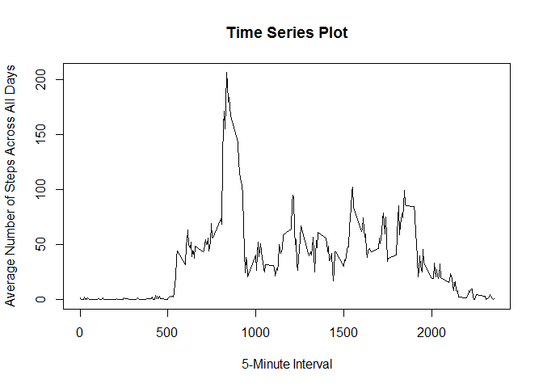
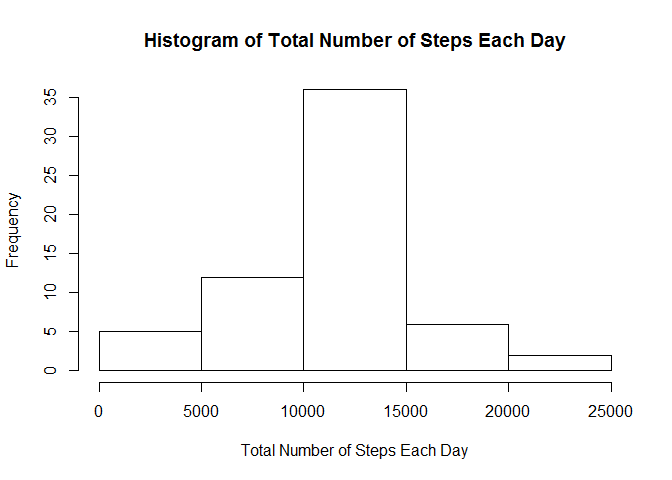
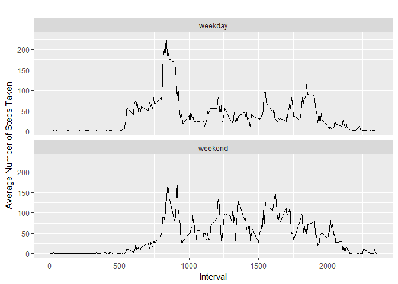

# Reproducible Research: Peer Assessment 1


## Loading and preprocessing the data

###1. Load the data (i.e.read.csv())

```r
if(!file.exists("./course5project1")){dir.create("./course5project1")}
#create a directory for the data
fileUrl <- "https://d396qusza40orc.cloudfront.net/repdata%2Fdata%2Factivity.zip"
#load the zipped data file
download.file(fileUrl,destfile="./course5project1/data.zip")
#download the zipped data file
unzip(zipfile="./course5project1/data.zip",exdir="./data")
#unzip the file to the directory that was created
activity <- read.csv("./data/activity.csv")
#read in the data file
```
###2. Process/transform the data (if necessary) into a format suitable for your analysis

```r
library(plyr)
#load necessary packages
activity$date <- as.Date(activity$date)
#converting to date
```


## What is mean total number of steps taken per day?

###1. Calculate the total number of steps per day

```r
totalsteps <- aggregate(activity$steps ~ activity$date, FUN=sum)
#aggregate the total sum of steps by date
colnames(totalsteps)<- c("Date", "Steps")
#adding column names
```
###2. Make a histogram of the total number of steps taken each day

```r
hist(totalsteps$Steps, xlab="Steps", main = "Total Steps per Day")
```

<!-- -->

```r
#create histogram of steps per day
```
###3. Calculate and report the mean and median of the total number of steps taken per day

```r
mean(totalsteps$Steps)
```

```
## [1] 10766.19
```

```r
#reporting the mean of the total number of steps
median(totalsteps$Steps)
```

```
## [1] 10765
```

```r
#reporting the median of the total number of steps
```

## What is the average daily activity pattern?

###1. Make a time series plot (i.e. type = "l") of the 5-minute interval (x-axis) and the average number of steps taken, averaged across all days (y-axis)

```r
clean <- activity[!is.na(activity$steps),]
##pulling data without NA
interval <- aggregate(steps ~ interval, clean, mean)
#aggregate average number of steps per interval, omitting missing data
plot(x = interval$interval, y = interval$steps, type = "l", main = "Time Series Plot", xlab = "5-Minute Interval", ylab = "Average Number of Steps Across All Days")
```

<!-- -->

```r
#plotting the data
```
###2. Which 5-minute interval, on average across all the days in the dataset, contains the maximum number of steps?

```r
maxsteps <- max(interval$steps)
#finding the maxium steps by interval
interval[interval$steps == maxsteps, 1]
```

```
## [1] 835
```

```r
#finding which interval had the maximum number of steps
```

## Imputing missing values

###1. Calculate and report the total number of missing values in the dataset (i.e. the total number of rows with NAs)

```r
nrow(activity[is.na(activity$steps),])
```

```
## [1] 2304
```

```r
#calculating the number of rows (steps) that have NAs
```
###2. Devise a strategy for filling in all of the missing values in the dataset. The strategy does not need to be sophisticated. For example, you could use the mean/median for that day, or the mean for that 5-minute interval, etc.
I will use the mean for each 5-minute interval.

###3. Create a new dataset that is equal to the original dataset but with the missing data filled in.

```r
data_imputed <- activity
for (i in 1:nrow(data_imputed)) {
  if (is.na(data_imputed$steps[i])) {
    interval_value <- data_imputed$interval[i]
    steps_value <- interval[
      interval$interval == interval_value,]
    data_imputed$steps[i] <- steps_value$steps
  }
}
#assigning the mean to each of the NA values
new <- aggregate(steps ~ date, data_imputed, sum)
#new data with total number of steps taken each day
```
###4. Make a histogram of the total number of steps taken each day and Calculate and report the mean and median total number of steps taken per day. Do these values differ from the estimates from the first part of the assignment? What is the impact of imputing missing data on the estimates of the total daily number of steps?


```r
hist(new$steps, main="Histogram of Total Number of Steps Each Day", 
     xlab="Total Number of Steps Each Day")
```

<!-- -->

```r
#creating a histogram of the total number of steps taken each day

mean(new$steps)
```

```
## [1] 10766.19
```

```r
#calculating the mean of the total number of steps taken each day

median(new$steps)
```

```
## [1] 10766.19
```

```r
#calculating the median of the total number of steps taken each day
```
The mean does not differ, but the median of the new data differs from the original.


## Are there differences in activity patterns between weekdays and weekends?

###1. Create a new factor variable in the dataset with two levels - "weekday" and "weekend" indicating whether a given date is a weekday or weekend day.


```r
data_imputed['daytype'] <- weekdays(as.Date(data_imputed$date))
data_imputed$daytype[data_imputed$daytype  %in% c('Saturday','Sunday') ] <- "weekend"
data_imputed$daytype[data_imputed$daytype != "weekend"] <- "weekday"
data_imputed$daytype <- as.factor(data_imputed$daytype)
#creating new factor variable in dataset weekday vs. weekend

newstepsbyinterval <- aggregate(steps ~ interval + daytype, data_imputed, mean)
#calculating average steps by interval by day type (weekday vs. weekend)
```
###2. Make a panel plot containing a time series plot (i.e. type = "l") of the 5-minute interval (x-axis) and the average number of steps taken, averaged across all weekday days or weekend days (y-axis). See the README file in the GitHub repository to see an example of what this plot should look like using simulated data.

```r
library(ggplot2)
qplot(interval, 
      steps, 
      data = newstepsbyinterval, 
      geom=c("line"),
      xlab = "Interval", 
      ylab = "Average Number of Steps Taken",
      main = "") +
  facet_wrap(~ daytype, ncol = 1)
```

<!-- -->

```r
#create panel plot 
```
